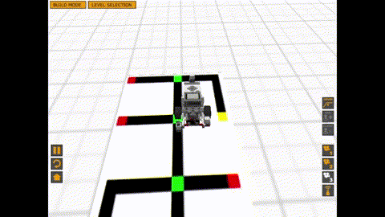

# NINJABOT by S(eh)arijadi

Welcome to the virtual world of our **NINJABOT**! **NINJABOT** is an example of BFS and DFS algorithm usage in **RobotC**.

Developed by:
- 13515001 Jonathan Christopher ([nathanchrs](https://github.com/nathanchrs))
- 13515002 Wenny Yustalim ([wennyyustalim](https://github.com/wennyyustalim))
- 13515071 Daniel Pintara ([nieltg](https://github.com/nieltg))

## System Requirements

**NINJABOT** uses and requires **Windows**. Tools required:
- [RobotC Lego Mindstorm EV3](http://robotc.net/download/lego/)
- [RVW Level Builder](http://robotvirtualworlds.com/levelbuilder)
- [Virtual Brick](http://robotvirtualworlds.com/virtualbrick)

## Run the Program

- Open **RobotC Lego Mindstorm EV3**.
- Open existing programs or write the magic down directly on the app.
- Compile the program and download it to the robot.
- **RVW Level Builder** will automatically appear.
- Build the levels as testcases.
- Click start level.
- Voila! Our **NINJABOT** is ready to run the track.

## Credits

Special thanks to [github.com](https://github.com) for hosting our project.
